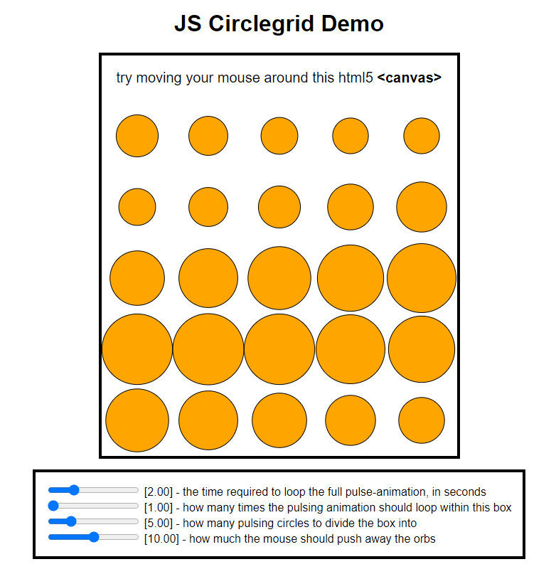

# Summary
This is my first JS script that is longer than a couple lines. **In few words: the Program draws a grid of moving shapes on an HTML5 Canvas**. 
 + The shapes have several animated properties, like their size. 
 + The shapes in the demo respond to mouse interaction. 
 + At runtime, Script variables can be tweaked via HTML input sliders. 
 
 The script itself is primarily a demo showing that I can:
+ use/learn JS (ECMAScript),
+ work out some trigonometry,
+ effectively use Math functions like Modulo or Atan2. 

***You can see this script as a webpage via GitHub Pages <a href="https://lucywatcher.github.io/ShapesJS/">HERE!</a>.*** 

Eventually, this code will be hosted on a page of my portfolio website, and you will be able to run it there as well.

<p align="center">
  
</p>

This is my first ever GitHub Repository. I am using this Repo to learn how to develop alongside GitHub. Later, I want to learn `GIT` itself on my PC command line, to ensure I understand everything. 

Because I was a beginner, Much of this code is **VERY** unoptimized, but, I think collapsing this simple code might make it unnecessarily hard to read. Further, a project so small won't really get any noticable benefits from optimization. So, I am leaving it as-is, with a few comments from my future self about the apparent flaws. speaking of which:
 
 
 
 
# Flaws:

+ I did not always use [upper-camel-case](https://en.wikipedia.org/wiki/Camel_case) when naming functions or variables, because I made this script while I was learning and did not know it was best practice.
+ To avoid errors, I lazily placed the initialization function at the bottom of the script.
+ I have numerous custom functions riddled with oversights. One such example is `getMousePos()`. 
  + It is run every single time the mouse is moved, even if the mouse moves a single pixel. It is called thousands of times for an average mouse movement.
  + every single time it is run, it gets a BoundingClientRect. This is somewhat obviously insane. ClientRects have a LOT of data in them (X and Y position, Widths and Heights, Relative Positions).
  + Instead, it should probably only grab the clientRect once, again if the user scrolls or resizes the window, or something ACTUALLY changes.
+ I define a ton of global variables. ***THIS IS BAD***. They might accidentally conflict with the global variables of other scripts! If another script used a global variable called `mousePos` or `divisions`, which seems ***entirely*** plausible, then both scripts would break. This is the equivalent of storing all the variables for a windows program inside of the PATH variable, or registry keys... completely unnecessary and wasteful!
+ In this project, my draw function evaluates a lot of math, and ***then*** draws the math's results, every single frame. In a more streamlined project, the draw function would probably ONLY handle drawing to the screen, and there would be separate functions that update WHAT to draw, only as necessary, to avoid lag caused by unnecessary calculation occuring every frame.


# Description

 The script checks if the user supports 2D canvas drawing, if they do, it tells the init function to run when the HTML page finishes loading. This init function runs `draw()` every `drawInterval` milliseconds... By default, this is every ***20*** milliseconds. This means it draws 50 times per second, and so that puts it at 50fps. The init function also defines some HTML input widgets. This is so the user can mess with parameters for the script while watching it run.
 
 The `Draw()` function itself is where most of the stuff happens. Every time draw is run, it increments `drawIteration++;`. This is to track how many times draw() has been run and how long the script has been running. An obvious issue with this approach, is that `drawIteration` will increase forever, every single frame, and become insanely large. For our simplistic purposes, this works fine.
 
## Drawing setup

 All animations are meant to loop every ***`playbackSpeed`*** seconds. This is very important. 
 
 I start the `draw()` script by seeing how many seconds have passed since init. Then, I compare how many seconds have passed to ***`playbackSpeed`*** using a Modulo operator. This tells me what percentage of the way I am through the current animation loop, given how many seconds have passed and how long each loop should be. 
 
 I use this percentage of "current loop completion" to control a sine wave. I use `Math.Sin()` for that. Every frame, the sine wave value is updated. The sine wave loops around every "`playbackSpeed`" seconds. I could use this sine wave to drive animations.
 
 A big part of this thing is that it divides the canvas into equal squares, like a grid, then draws a shape in each square. The variable `divisions` represents the desired number of divisions to split the canvas into. If divisions is 5, the canvas should have 5 equal rows and 5 equal columns. My draw function gets the width of the canvas, and divides this by `divisions`, to get the desired width of each segment. This script lazily assumes canvas width and height are equal. If they weren't, nothing particularly bad would really happen. It would just look weird.
 
## Actually Drawing Stuff
  The draw function has a `for` loop representing rows, nested in a `for` loop representing columns.
```js
for (let col = 0; col < divisions; col++) {
    for (let row = 0; row < divisions; row++) {
    
       // drawstuff
    }
 }
```
 This is so we draw a shape for every row, for every column. I use `row` and `col` to figure out where to draw the "current" shape, every iteration.
 
 We already have a sine wave updating every frame, so we could easily have all the circles expand and contract together by setting their size from that sine wave, but this wasn't cool enough. I wanted all the circles to oscillate independently, in a visually pleasing "wave".
 
 To achieve this, there is some sloppy/confusing math inside these loops that makes a new sine wave. The sine wave is updated every time a shape is drawn. It uses the current `row` and `col` to figure out its current value. This new sine wave also is constantly being offset, and the offset loops back around 360 degrees every `playbackSpeed` seconds, so its like a pleasing wave slowly "passing through" the shapes.
 
 The actual drawing of shapes comes last, and is very simple. we jump to where we will draw the circle, using the current `row` and `col` as reference, then, we draw a circle... The size is affected by the sine wave described above!

## Mouse Interaction
 I wanted the mouse to "repulse" the circles away from it. Every time I was going to draw a circle, I needed to calculate the direction and distance of the mouse, and then move the circle in the opposite direction, in an amplitude/amount based on the distance from the mouse. Since this deals with amplitudes and directions, this is some sort of vector math or trigonometry. This was the hardest part for me. 
 
 I didn't graduate high school. I have ADHD/Autism, and I didn't really know that even a year ago. My whole life until high school, instead of studying, I'd only pass tests with common sense, then forget everything in them. I might know a lot of random stuff, but I ***dont*** know any trigonometry, and I haven't memorized any formulas. I actually know a lot more about trigonometry now, thanks to this project.
 
 The math I used for this, I figured out by scraping Google for 15 minutes or so. Khan Academy ended up listing a formula somewhere that I Googled, messed with, then adapted for my usage. Writing this code taught me how Cosine, Sine, and Tangent functions work. 

### The Math
 I first started this section of documentation by attempting to explain trigonometry from its basics, since it was mind blowing to me when I figured this stuff out. I realized this is a *really weird place to do that though*. To avoid bloating this readme with the 6 paragraphs I originally wrote, I'll just assume you understand Trigonometry. 
 
 *The code below is not used in the real project, but is a simplification of it:*

```js
// For the math, let's make the shape location represent (0,0) so we get the mouse position relatively.
// we need the direction and distance of the mouse from the shape, NOT from (0,0) in the canvas....
let x = mousePos.x - shapeX;
let y = mousePos.y - shapeY;

// inverse tangent gets direction in radians
let mouseDirection = Math.atan2(y, x); 

// Get the distance of the mouse. A squared + B squared = C squared. 
let mouseDistance = Math.sqrt(Math.pow(x,2), Math.pow(y,2))

// change the shape position!
shapeX += ( Math.cos(mouseDirection) * (mouseDistance*-1) );
shapeY += ( Math.sin(mouseDirection) * (mouseDistance*-1) );
```
 I used `Math.atan2()` to get the angle pointing to the mouse cursor, in radians.
 
 I also use the pythagorean theorem (this is something I actually did remember from school) to calculate the distance to the mouse cursor.

 Finally, I actually change the X and Y position of the shape. I am multiplying mouseDistance by -1 so that the shape moves in the opposite direction of the mouse, since my desired effect was repulsion and not attraction. Basically, I turn `distance` and `direction` back into a set of coordinates, with the help of Cosine and Sine.

 This code is mostly featureless compared to the project, and does not work; It's just a breakdown of the trigonometry. The project is a lot messier, but it uses `clamp` and `pow` to make the effect smoother, as well as limited between a range. Theres a lot more going on inside the project to make it work.
 
 
 
 
 
# Closing Statements
 This project was my first full JS script, and I learned a lot doing it. It's pretty bare, and has many issues, but since it was made across a single day with practically no experience, I think it's a good way to show that I have some critical thinking skills, can find solutions to problems, and can handle documentation and/or learning a language.


